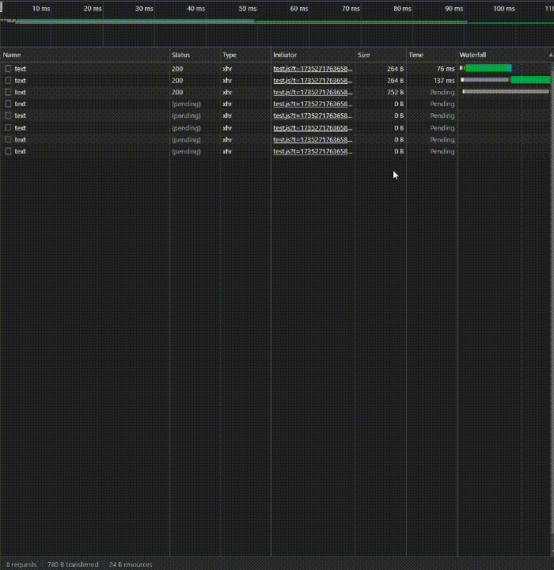

---
{
  "title": "多请求控制并发：队列",
  'description': "同时有很多很多请求的情况下,使用队列来控制并发请求"
}
---
# 多请求控制并发：队列

面试官：看你简历上做过图片或文件批量下载，那么假如我一次性下载几十个，如何去控制并发请求的？
让我想想，额~， 选中ID，循环请求？，这样肯定G！一下子请求这么多，到时候服务器直接崩溃啦！突然灵光一现，搞个请求队列！！！
我：模拟任务队列，从而实现请求池效果。
面试官：6！

废话不多说，正文开始：

众所周知，浏览器发起的请求最大并发数量一般都是6~8个，这是因为浏览器会限制同一域名下的并发请求数量，以避免对服务器造成过大的压力。

首先让我们来模拟大量请求的场景
```javascript
const ids = new Array(100).fill('')

console.time()
for (let i = 0; i < ids.length; i++) {
  axios.get('/api/test' + i)
}
console.timeEnd()
```


一次性并发上百个请求，要是配置低一点，又或者带宽不够的服务器，直接宕机都有可能，所以我们前端这边是需要控制的并发数量去为服务器排忧解难。

## 1. 什么是队列

先进先出就是队列，从队列尾部`push`,从队列头部`pop`在js中用`shift`。我们看下面的动图可能就会更加的理解：


我们接下来的操作就是要模拟上图的队列行为，将所有的请求一次性全部push到队列里，然后启动队列，依次出列到最大并发数，并发请求，如果有有请求完成，则继续出列，直到队列为空。

## 2. 实现队列

我们先设想是一下这个队列的使用方式
```javascript
const requestQueue = new requestQueue(6)
for (let i = 0; i < reqs.length; i++) {  // 请求
    requestQueue.push(()=> axios.get('/api/test'))
}
requestQueue.start()
```
我们定义一个类，输入队列最大长度(也就是最大并发请求数)，然后定义一个push方法，用来将请求push到请求堆里，以及一个start方法，用来启动队列。

```javascript
class requestQueue {
    concurrency = 6 // 最大并发请求数
    current = 0     // 当前队列中请求数
    queue = []      // 请求队列
    constructor(concurrency) {
        this.concurrency = concurrency
    }
    push(req) {
        this.queue.push(req)
    }
    start() {
        //启动队列
        this.dequeue()
    }
}
```
## 3. 实现dequeue函数
```javascript
dequeue = () => {  
  while (this.current < this.concurrency && this.queue.length) {  
    this.current++;  
    const requestPromiseFactory = this.queue.shift() // 出列  
    requestPromiseFactory()  
      .then(() => { // 成功的请求逻辑  
      })  
      .catch(error => { // 失败  
        console.log(error)  
      })  
      .finally(() => {  
        this.current--  
        this.dequeue()  
      });  
  }  
}
```

这个函数用于从请求队列中取出请求并发送。它在一个循环中运行，直到当前并发请求数`current`达到最大并发数`concurrency`或请求池`queue`为空。对于每个出队的请求，它首先增加`current`的值，然后调用请求函数`requestPromiseFactory`来发送请求。当请求完成（无论成功还是失败）后，它会减少`current`的值并再次调用`dequeue`，以便处理下一个请求。

## 4. 完整代码&实验

```javascript
class requestQueue {
    concurrency = 6 // 最大并发请求数
    current = 0     // 当前队列中请求数
    queue = []      // 请求队列
    constructor(concurrency) {
        this.concurrency = concurrency
    }
    push(req) {
        this.queue.push(req)
    }
    start() {
        //启动队列
        this.dequeue()
    }
    dequeue = () => {  
        while (this.current < this.concurrency && this.queue.length) {  
            this.current++;  
            const requestPromiseFactory = this.queue.shift() // 出列  
            requestPromiseFactory()  
            .then(() => { // 成功的请求逻辑  
            })  
            .catch(error => { // 失败  
                console.log(error)  
            })  
            .finally(() => {  
                this.current--  
                this.dequeue()  
            });  
        }  
    }
}
```

实验代码

```javascript
const ids = new Array(100).fill('')
const queue = new requestQueue(6)
for (let i = 0; i < ids.length; i++) {
    queue.push(()=> axios.get('/api/test'))
}
queue.start()
```

结果：

