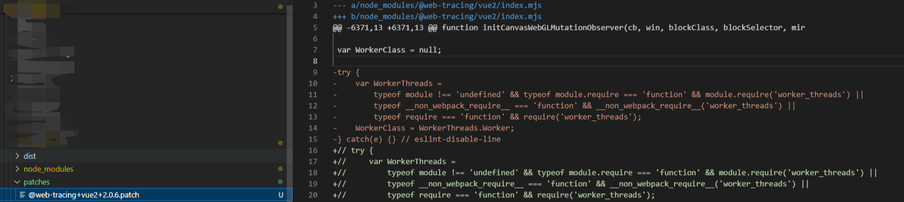

# 项目中修改node_modules中的文件

## why

why？为什么要修改`node_modules`里面的文件？修改了`node_modules`会怎么样？
***
当然是因为一些坑爹的需求，比如：你不得不使用某个第三方组件库（列如同事部门写的挂在npm组件库），这个第三方组件库不满足你现在的需求而且未来可能也不会满足，所以你只能改造这些插件，这个时候就需要修改`node_modules`里面对应的第三方组件库文件。

## 方法一：直接修改
直接修改`node_modules`里的文件，打包、上传。
***
ok、没有问题实现效果
### 缺点
- 修改的代码无法传递到队友处，如果队友同事也打包上传了，那么线上就缺乏了这部分代码
- 重新装包就恢复原状了
- 不够优雅

## 方法二：通过插件，在编译阶段修改源码
这里的插件指的是自定义插件，这里拿vite举例，我们新建一个自定义插件,目的是修改 uview-plus组件库下u-button的代码
```js
// vite-plugin-custom.js
export default function customPlugin() {
  return {
    name: 'custom-console-log-plugin',
    transform(code, id) {
      if (id.includes('uview-plus')&&id.includes('u-button')) { 
        console.log('u-button',id, code);
        // 例如，你可以简单地替换一些字符串或调用其他转换逻辑
        const modifiedCode = code.replace(/someOldCode/g, 'someNewCode');
      }
      return {
        code:modifiedCode,
      };
    }
  };
}
```
然后，在你的 `vite.config.ts` 文件中注册这个插件：
```js
import { defineConfig } from 'vite';
import modifyNodeModulesPlugin from './vite-plugin-custom.js';
export default defineConfig({
  plugins: [modifyNodeModulesPlugin()],
  // 其他配置...
});
```
> webpack 同理就不做阐述

### 缺点

- 相比起上一个方法，这个方法可以被git记录，但是如果需要修改的文件一多，字符串操作起来会很麻烦，并且不利于后期维护
- 不够优雅
  
## 方法三：下载源码，自己维护
我们可以将`node_modules`里面的第三方组件库下载到本地，然后通过一下几种方式来修改引用路径来达到效果
- `vite` 或者 `webpack` 的 `alias` 来对引用路径进行替换 
```js
    resolve: {
        alias: {
            'element-plus': resolve(root, './', 'element-plus')
        },
    },
```
- 将源码克隆，自己发布到npm，然后在项目中引用
  
  ### 缺点
  - 如果要发布到npm，流程比较复杂，自己要管理一套

## 方法四（推荐）：使用patch-package
1. 安装 `patch-package`
```shell
npm i patch-package --save-dev
```
2. 修改脚本 package.json

在 package.json 的 script 中增加
```json
"postinstall": "patch-package"
```
3. 修改node_modules
修改完依赖后，运行 patch-package 会自动创建 patch 文件
```shell
// 例： npx patch-package element-ui
npx patch-package 依赖名称
```
根目录下会多一个patches补丁目录

4. 注意事项
patch是锁定版本号的，如果升级了版本，patch内容将会失效，最好在package.json能够锁定版本号。